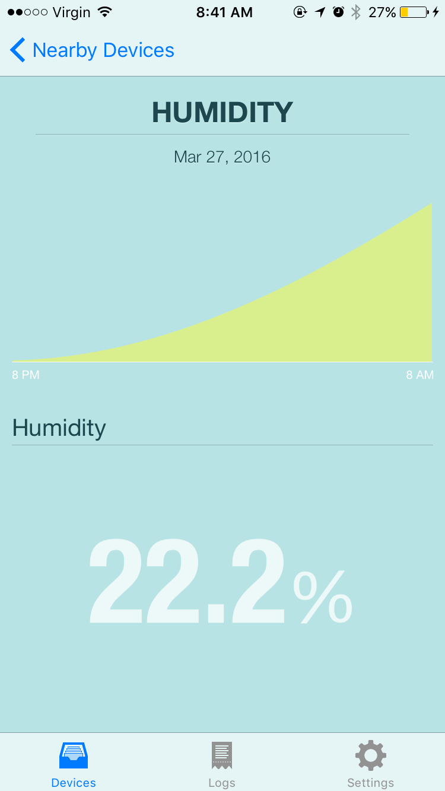

================
Browse
================

Device List
-------------
.. image:: ../images/device_list.png
   :height: 400px

The list displays nearby sensors. More specifically, when this app detect a registered iBeacon,
it convert the beacon's UUID to a semantic location name based on the mapping defined in Setting.
Then, the app displays Building Depot sensors with matching *location* metadata.

Data Visualization
--------------------

When you select one of the displayed sensors, the app visualizes its data.
The graph shows recent sensor readings. The duration varies based on sensor types.
You can touch the graph to check sensor value at a point.

If you are using demo data generated by demo.py and do not see any data in this screen.
The generated demo sensor readings become too old. Run demo.py again to generate demo
sensor readings again.