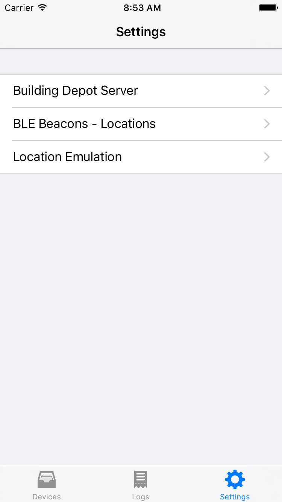

==================
Setup
==================

iOS application
^^^^^^^^^^^^^^^^^
Open Settings tab at the bottom right corner and configure the followings.

Building Depot Server
-----------------------
This category contains parameters used to communicate
with a Building Depot server to find sensors and to fetch sensor readings.

GiottoDataViewer uses these parameters in the format
**http://<address>:<port>/path/to/api**

========= ========================================================================
Address   Building Depots' address (e.g., buildingdepot.cmu.edu or 128.2.113.118)
--------- ------------------------------------------------------------------------
Port      82 (with default Building Depot's settings)
========= ========================================================================

BLE Bacons - Locations
-----------------------
This category contains mapping between iBeacons UUIDs and semantic locations.
Click *Add* button to create a new mapping.
When an iOS device is in a iBeacon range with a specified UUID,
GiottoDataViewer lookup Building Depot's sensors with metadata *location* is equal to
the semantic location specified in this setting.

Location Emulation
-------------------
If you do not have an iBeacon or do not want to setup one, you can emulate a location here.
Type a name of semantic location (e.g., Room1) and GiottoDataViwer lookup sensors for
the location.

Building Depot
^^^^^^^^^^^^^^^
In Building Depot, you need to create sensors with metadata *location* and *type*.
*type* should be one of the followings.

- Temperature
- Humidity
- Lux
- Pressure

Refer the Building Depot document for more detail.

If you want to quickly test the app, run demo.py to create dummy sensors and
put dummy sensor readings into them. Type **Room1** in the location emulation
to see these sensors.

Please note that GiottoDataViewer displays
recent sensor readings. Thus, after a while, the dummy sensor readings will not
be displayed. In this case, please run demo.py again.

